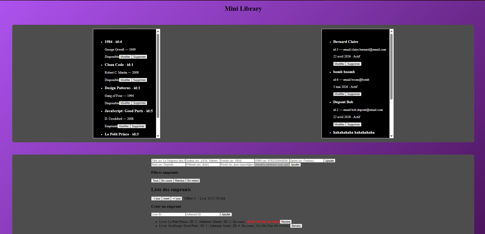

**Créé par Guigui_Slide le 17/03/2026**
# MiniLib - API REST Node.js / Express

MiniLib est une petite bibliothèque qui fournit une API REST pour gérer des livres et des emprunts.

Ce projet utilise Node.js, Express et PostgreSQL comme base de données.

## Installation et lancement

1. Cloner le projet avec `git clone https://github.com/Guigui-Slide/minilib.git`
2. Installer les dépendances avec `npm install`
3. Créer un fichier `.env` avec les variables d'environnement suivantes :
   - `DB_HOST` : hôte de la base de données PostgreSQL
   - `DB_PORT` : port de la base de données PostgreSQL
   - `DB_NAME` : nom de la base de données PostgreSQL
   - `DB_USER` : utilisateur de la base de données PostgreSQL
   - `DB_PASSWORD` : mot de passe de l'utilisateur de la base de données PostgreSQL
4. Exécuter le schéma de la base de données :
   ```bash
   psql -U minilib_user -d minilib -f database/schema.sql
   ```
5. Exécuter les données de test :
   ```bash
   psql -U minilib_user -d minilib -f database/seed.sql
   ```
6. Lancer le backend et le frontend en parallèle :
   ```bash
   npm run dev
   ```
7. Aller sur l'URL du frontend dans le navigateur.

## Utilisation de l'API

1. Utiliser un outil comme Postman ou Bruno pour envoyer des requêtes HTTP vers le serveur.

Exemples de requêtes :

- GET `/api/v1/livres` : récupère la liste de tous les livres
- GET `/api/v1/livres/:id` : récupère un livre par son id
- POST `/api/v1/livres` : crée un nouveau livre
- PUT `/api/v1/livres/:id` : modifie un livre existant
- DELETE `/api/v1/livres/:id` : supprime un livre existant

2. Lancer le site avec deux terminaux et tester directement :
   ```bash
   cd backend
   npm run dev
   ```
   ```bash
   cd frontend
   npm run dev
   ```
   puis ouvrir l'adresse du frontend dans le navigateur.

3. Utiliser Docker :
   ```bash
   docker compose down -v
   docker compose up --build db backend frontend
   ```
   Accéder à l'app depuis Docker après avoir lancé la commande à la racine du dossier `minilib`.

## Image du projet


